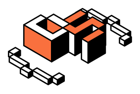

# 

## ✨ Desafios

- [Border Radius Previewer - 001](apps/border-radius-previewer/)
- [Flags with CSS - 002](apps/flags-with-css/)

## 🧑‍💻 Como executar

Clone o projeto e acesse sua pasta

```bash
git clone https://github.com/wendson13/soutinho-challenges

cd soutinho-challenges
```

Instale as dependências

```bash
 npm install
```

Execute todos projetos com npm

```bash
# executar todos os projetos
 npm run dev
```

Execute um projeto individualmente com npm

```bash
# executar o projeto: npm run dev:(projectId)
 npm run dev:001
```

acesse o projeto em [localhost:5173](http://localhost:5173/) em seu navegador.

## ©️ Creditos

Desafios por:

- [Dev Soutinho](https://labs.mariosouto.com/)

## 📝 License

Esse projeto está sob a licença MIT. Veja [LICENSE](LICENSE) para mais detalhes.
