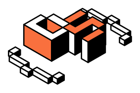
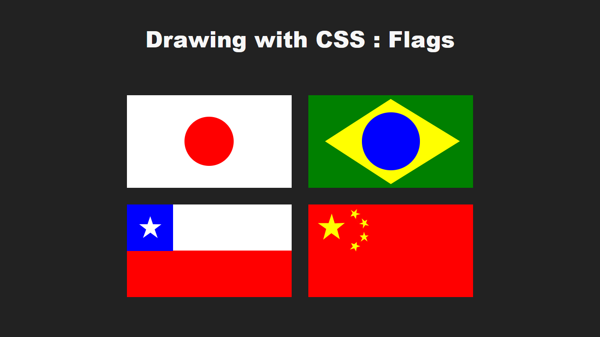

  

## 🌐 Preview

- [Flags with CSS](https://soutinho-challenges-flags-with-css.vercel.app/)

## ✨ Tecnologias

- [Vite](https://vitejs.dev/)
- [Typescript](https://www.typescriptlang.org/)
- [Eslint](https://eslint.org/)
- [Prettier](https://prettier.io/)
- [React](https://reactjs.org/)
- [Styled Components](https://styled-components.com/)

## 📌 Layout

layout usado no projeto no link abaixo

- [layout web](https://www.figma.com/file/0dyop7klMD1T11lDryVNSB/%23002---Desenho-com-CSS-%3A-Bandeiras?node-id=2%3A212&t=MU5rGvlOfMVvXfHF-0)

## ©️ Creditos

Desafio por:

- [Dev Soutinho](https://devsoutinho.notion.site/Desenho-com-CSS-Bandeiras-DevSoutinhoChallenges-800d9c4fceff4bb1a24cf218879b067f)

## 📝 License

Esse projeto está sob a licença MIT. Veja [LICENSE](LICENSE) para mais detalhes.
